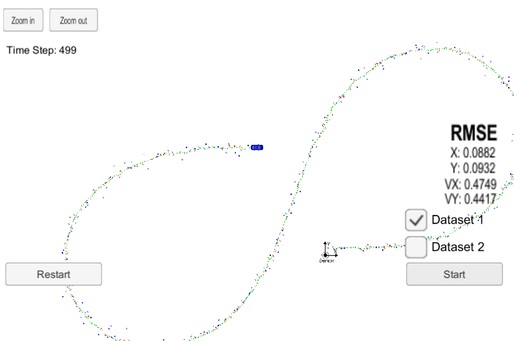
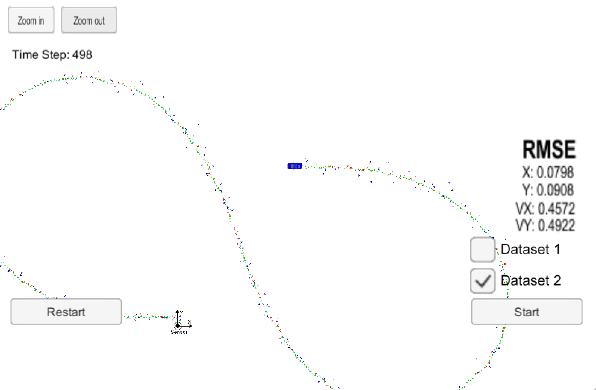
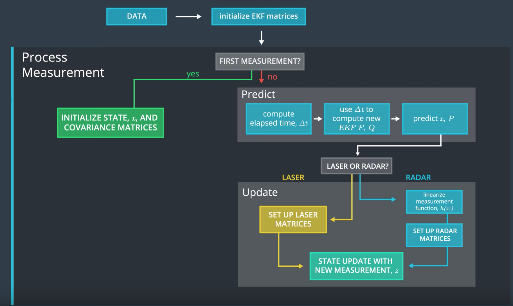

# Extended Kalman Filter

# Overview
This project is a C++ implementation of an Extended Kalman Filter for fusing measurements from Radar and Lidar sensors.  This implementation is used to predict the position and velocity of an object given different sensor measurements taken over some time period.  The base project with dependecy info and build instructions can found [HERE](https://github.com/udacity/CarND-Extended-Kalman-Filter-Project).  

# Data
The project contains two datasets which contain sensor data for the position and velocity in the x and y directions as well as a timestamp.  The two datasets are mirror images of each other reflected over the y-axis.

# Dataset 1

# Dataset 2

# Rubric
## Compiles
Check

## RMSE <= [.11, .11, .0.52, 0.52]
Dataset 1  RMSE = [0.088, 0.093, 0.475, 0.441]

Dataset 2  RMSE = [0.080, 0.091, 0.457, 0.492]

## Correct Algorithm

Implementation is based on the TODO sections specified in the base project.  

- [X] Initializes matrices and vectors
- [X] Updates on first measurements
- [X] Predicts and Updates on new measurements

## Code Efficiency

Calculations are done on a necessary basis.  One obvious thing to improve is to calculate Q only once based a constant delta_T if that can be assumed but I left it to be calculated for each measurements for situations in which there are meaningful variations.
  